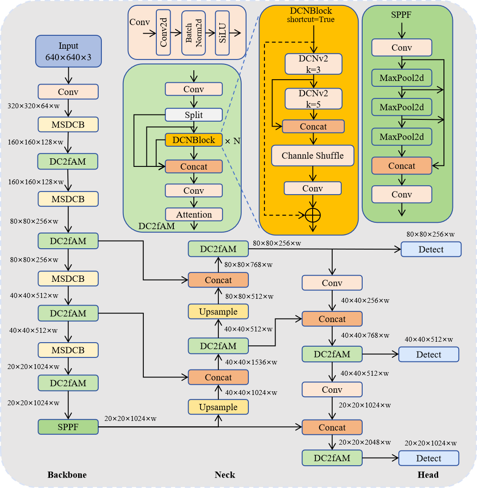
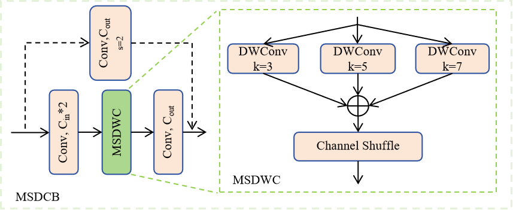
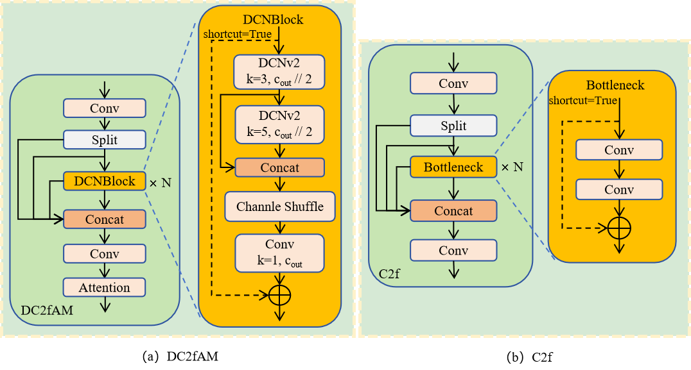

# MSDC-YOLO

We propose an improved YOLOv8-based model, termed MSDC-YOLO.
We design a Multi-Scale Depthwise Convolution Block (MSDCB) and Attention Fusion Module (DC2fAM) to enhance the performence in defect detection. The code, model weights will be released publicly upon acceptance of this paper.
Training logs and test logs are detailed in the train_log folder and test_log folder, respectively.

Zhenyuan Lin, Yubo Dong*, Dahua Gao, Anqi Li, Linde Ji, Weikun Li 

## Overall

Figure 1: Overall architecture of MSDC-YOLO, which is built upon YOLOv8 while integrating MSDCB and DC2fAM.

Figure 2: Structure of the Multi-Scale Depthwise Convolution Block
(MSDCB).

Figure 3: Comparison of module structures: (a) the proposed DC2fAM
module; (b) the baseline C2f module.

## Experiments
Table 1: Comparison results on the APDDD dataset. Best results are in bold, and the second-best results are underlined.

Table 2: Comparison results on the NEU-DET dataset. Best results are in bold, and the second-best results are underlined.

master
